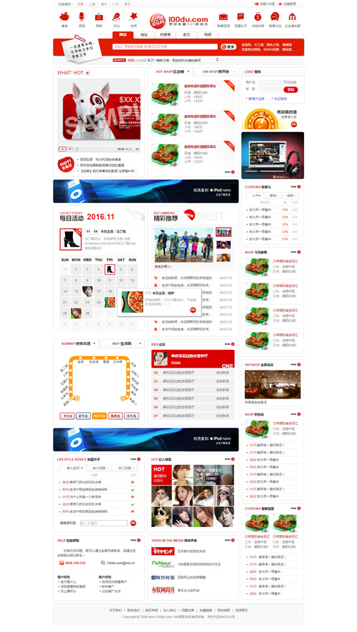

# 个人项目清单

这是我的个人项目清单，欢迎查阅。

## 1.电子商务网站首页

一个电商类网站的首页，使用模块化布局的思路，按照设计稿完成商城首页的结构和样式，并使用jQuery实现搜索切换、图片轮播、选项卡切换等功能。[预览](https://gordon8.github.io/project/mall)


## 2.门户类网站首页

一个门户类网站的首页，使用模块化布局的思路，按照设计稿完成商城首页的结构和样式，并使用jQuery实现搜索切换、图片轮播、选项卡切换等功能。[预览](https://gordon8.github.io/project/pmbaike)


## 3.个人主页

个人展示页面，采用响应式布局的设计，同时，使用了 HTML5 和 CSS3 的新特性。另外使用JS增强交互体验。[预览](https://gordon8.github.io/project/resume)


## 4.一个3D轮播组件

一个基于```jQuery```编写的3D轮播插件，[预览](https://gordon8.github.io/project/hCarousel)

