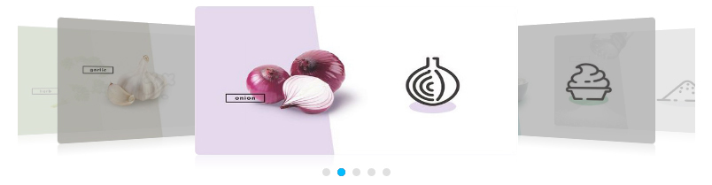

# 一个3D轮播组件

## 简介

一个基于```jQuery```编写的3D轮播插件，[预览](https://gordon8.github.io/project/hCarousel)


## 使用方法

该轮播组件，只需在页面中引入```jQuery```，以及一个```js```文件和```css```文件，示例如下。

```javascript

<link rel="stylesheet" href="css/hCarousel.css">

...

<script src="js/lib/jquery-3.1.0.min.js"></script>
<script src="js/hCarousel.js"></script>

```

然后，```new```一个```$.HCarousel```对象，传入相应参数，示例如下。

```javascript

<div id="wrap"></div>

<script>
    var hCarouselData = [{
        url: 'https://github.com/gordon8', //url为a链接href地址
        img: 'img/carousel/img0.jpg'       //img为img的src资源，至少需传入5个元素
    }, {
        url: 'https://github.com/gordon8',
        img: 'img/carousel/img1.jpg'
    }, {
        url: 'https://github.com/gordon8',
        img: 'img/carousel/img2.jpg'
    }, {
        url: 'https://github.com/gordon8',
        img: 'img/carousel/img3.jpg'
    }, {
        url: 'https://github.com/gordon8',
        img: 'img/carousel/img4.jpg'
    }];
    var hCarousel = new $.HCarousel({
        $wrap: $('#wrap'),   //jQuery元素，外层包裹容器，默认为body
        data: hCarouselData, //上面传入的数据
        current: 1,          //整数，第一个正面显示的图片的序号，取值范围为0~hCarouselData.length-1，默认为0
        autoPlay: true,      //Boolean值，是否自动播放，默认true
        interval: 1000       //毫秒数，自动播放时间间隔，默认3000
    });
</script>

```

## 实现思路

### HTML结构部分


上图为demo的结构图，最外层用一个```class```为```carousel```的容器来包裹，内部包含两个容器，分别为```class```为```img-list```轮播图容器和```class```为```switch-list```的切换按钮容器。


```img-item```内部包含一个```img```标签和一个```class```为```img-modal```的遮照层。

```switch-list```结构为```ol```包着几个```li```。

### CSS布局部分

如效果图所示，展现出来的五张图片在3D空间中部分互相重叠，并且最中间图片处于最上层。
为便于实现该效果，在demo中我先设定```carousel```的宽度和高度，其中高为194px，宽为765px，然后设置```overflow: hidden```隐藏内部超出部分。内部的```img-list```宽度设置和父容器一样长也为765px，高度设置为168px，并且设置```position: relative```。因此，内部的```img-item```便可使用绝对定位来控制每一个的定位。将```left-img-item、prev-img-item、main-img-item、next-img-item、right-img-item```等```class```添加到各个```img-item```上，通过设置不同```z-index、opacity、left、transform```，实现3层结构。各个```img-item```使用不同的```left```来作一个排列，其中，最左的```img-item```和最右的```img-item```透明度为.3，前一个和后一个```img-item```的透明度为.8，中间```img-item```透明度为1。
当```img-item```在正面的时候```img-modal```的颜色为透明，而```img-item```移动到侧面时给```img-modal```的背景色设置为```rgba(0, 0, 0, .3)```。

每个```img-item```都设置```transform```中的```perspective、rotateY、translateZ```三个属性，```perspective```是控制景深的，```rotateY```是控制图片沿着Y轴旋转的，```translateZ```改变图片在z方向的位置来产生近大远小的效果。最后给图片设置个```transition:all .8s;```，这样在切换的时候就有过渡效果了。

```switch-item```默认样式为灰色的小圆，选中的```li```加个```switch-item-active```的```class```，修改背景色。

### JS交互部分

js部分主要是基于jQuery，并组合使用构造函数模式和原型进行封装。

```javascript

$.HCarousel = function (opts) {
    var defaultOpts = {    //设置默认参数
        $wrap: $('body'),
        current: 0,
        autoPlay: true,
        interval: 3000
    };
    this.opts = $.extend(defaultOpts, opts);
    this.init(opts);
};

$.HCarousel.prototype = {
    init: function () {
        //初始化内部各个函数
    },
    attachEl: function () {
        //根据数据添加dom节点，完成html的初始化，给HCarousel添加属性并赋值...
    },
    bind: function () {
        //绑定点击切换图片，鼠标移入暂停自动播放等事件。
    },
    switchItem: function (index) {
        //切换img-item，即轮播图片的核心方法...
    },
    autoPlay: function () {
        //通过setInterval定义自动播放函数
    },
    stopAutoPlay: function () {
        //通过clearInterval定义停止自动播放函数
    },
    addStyle: function () {
        //通过添加class实现添加样式
    },
    clearStyle: function () {
        //通过移除class实现移除样式
    }
};

```

详细实现过程可查看源代码。


