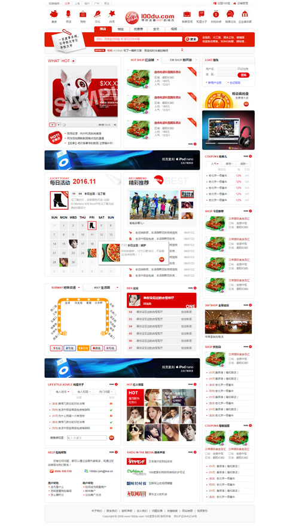

# 电子商务网站首页

## 项目简介

一个电商类网站的首页，使用模块化布局的思路，按照设计稿完成商城首页的结构和样式，并使用jQuery实现搜索切换、图片轮播、选项卡切换等功能。[预览](https://gordon8.github.io/project/mall)

## 制作过程

### HTML结构部分

整体结构主要有五部分，分别是：header、nav、search、content和footer。其中，content部分又分为两部分：main 和 sidebar。其中包含各个可复用section、option以及tab组件。

### CSS部分

1. 初始化样式--reset
2. 定义公共样式--public
3. 定义整体布局样式--layout
4. 定义header部分样式
5. 定义nav部分样式
6. 定义search部分样式
7. 定义content部分样式（其中包含各组件样式）
8. 定义footer部分样式

### javaScript部分

主要包含7个功能：

1. 切换搜索框功能
   切换搜索栏选项，搜索框内文字随之改变。

2. update轮播功能
   update内容自动滚动，也可通过上下按钮进行切换。

3. 选项卡切换功能
   点击或鼠标移入选项卡，切换内容。

4. 自动播放焦点图片
   自动播放焦点图片，并随之更新描述信息，同时加入鼠标移入暂停播放，移除自动播放功能。

5. 日历提醒信息
   鼠标移入显示当天活动信息。

6. BBS高亮显示
   通过改变class实现样式切换。

7. HOT用户鼠标提示效果
   鼠标移入图片，显示相关用户介绍信息。

详细实现过程可查看源代码。

